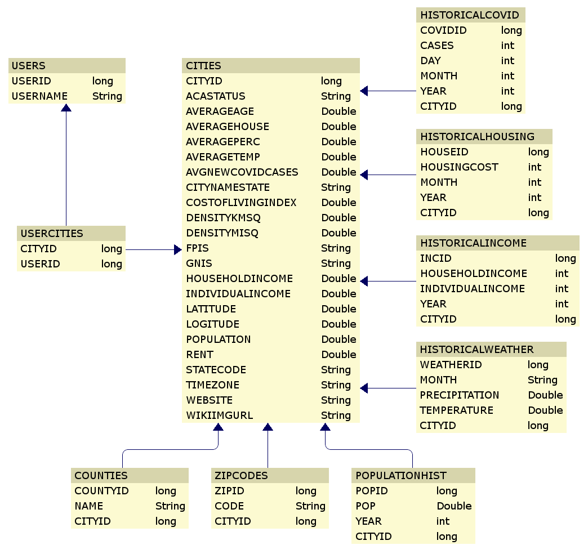

# Citrics

A city metrics app to help find the perfect city for you!

### Key Features

- View useful metrics, including population, age, cost of living, income, and more!
- Currently features information on 1200+ US cities, with more to come
- Select up to three cities to compare side-by-side
- *Future predictions coming soon*

## Base URL
- https://labs28-citrics-a-back.herokuapp.com/

## Swagger Documentation
- https://labs27-c-citrics-api.herokuapp.com/swagger-ui.html#/

# Contributors

| [Adonis Puente](https://github.com/adonispuente)                                                                                                                | [Cameron Honis](https://github.com/CameronHonis)                                                                                                                     | [Peter Wood](https://github.com/numbers0580)                                                                                                                     |
|-----------------------------------------------------------------------------------------------------------------------------------------------------------------|----------------------------------------------------------------------------------------------------------------------------------------------------------------------|----------------------------------------------------------------------------------------------------------------------------------------------------------------------|
|  |  |  |
|                                                                        |                                                                              |                                                                              |
|                         |                                       |

 

# APIs

#### [Front End](https://main.d369qbtk76ew1j.amplifyapp.com/) deployed via AWS Amplify

#### [Back End](http://labs28-citrics-a-back.herokuapp.com/) deployed via Heroku

#### [Data Science](http://citrics-ds.eba-jvvvymfn.us-east-1.elasticbeanstalk.com) deployed via AWS Elastic Beanstalk

# Contributing

When contributing to this repository, please first discuss the change you wish to make via issue, email, or any other method with the owners of this repository before making a change.

Please note we have a [code of conduct](./code_of_conduct.md). Please follow it in all your interactions with the project.

## Issue/Bug Request

**If you are having an issue with the existing project code, please submit a bug report under the following guidelines:**

- Check first to see if your issue has already been reported.
- Check to see if the issue has recently been fixed by attempting to reproduce the issue using the latest master branch in the repository.
- Create a live example of the problem.
- Submit a detailed bug report including your environment & browser, steps to reproduce the issue, actual and expected outcomes, where you believe the issue is originating from, and any potential solutions you have considered.

### Feature Requests

We would love to hear from you about new features which would improve this app and further the aims of our project. Please provide as much detail and information as possible to show us why you think your new feature should be implemented.

### Pull Requests

If you have developed a patch, bug fix, or new feature that would improve this app, please submit a pull request. It is best to communicate your ideas with the developers first before investing a great deal of time into a pull request to ensure that it will mesh smoothly with the project.

Remember that this project is licensed under the MIT license, and by submitting a pull request, you agree that your work will be, too.

### Pull Request Guidelines

- Update the README.md with details of changes to the interface, including new plist variables, exposed ports, useful file locations and container parameters.
- Ensure that your code conforms to our existing code conventions and test coverage.
- Include the relevant issue number, if applicable.
- You may merge the Pull Request in once you have the sign-off of two other developers, or if you do not have permission to do that, you may request the second reviewer to merge it for you.

## Tech Stack

#### JAVA
#### SPRING BOOT
#### JUNIT5

## Documentation

See [Front End Documentation](https://github.com/Lambda-School-Labs/Labs27-C-Citrics-FE) for details regarding the Front end of our project.

See [Data Science Documentation](https://github.com/Lambda-School-Labs/Labs27-C-Citrics-DS) for details regarding the Data Science of our project.

## Architecture

[Architecture Diagram](https://whimsical.com/4UKop3aqMB3KJRG2LXZzM6)

Tables

## Cities CRUD

Method | Endpoint | Description | Required Data
--- | --- | --- | ---
POST | /cities/fav/:cityid | x | x
GET | /cities/all | x |
GET | /cities/:cityid | x |
GET | /cities/allid | x |
GET | /cities/avg | x |

## Users CRUD

Method | Endpoint | Description | Required Data
--- | --- | --- | ---
POST | /users/user | x | x
GET | /users/users | x |
GET | /users/:userid | x |
GET | /users/user/name/:username | x |
GET | /users/user/name/like/:username | x |
GET | /users/getuserinfo | x |
GET | /users/fav | x |
PUT | /users/user/:userid | x | x
PATCH | /users/user/:userid | x | x

